

  
  
  

<h2 align="center">
  
  Arch Hyprland Dotfiles
  
</h2>

---

<h2 align="center">
  
  Showcase
  
</h2>

  
<b>Click to collapse/expand screenshots</b>

   

  

    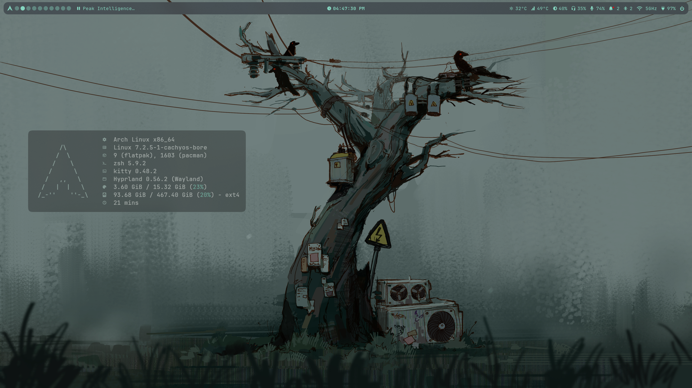
  

  

    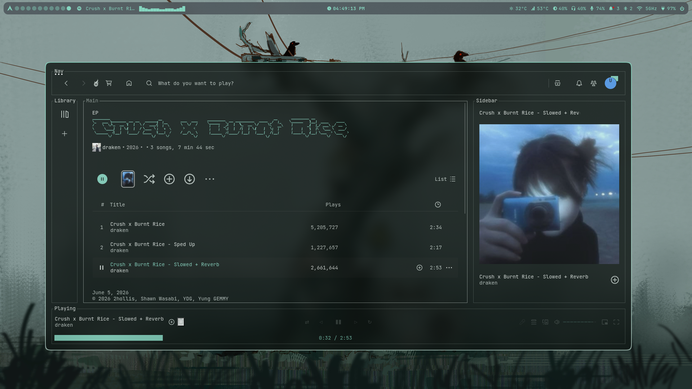
  

  

    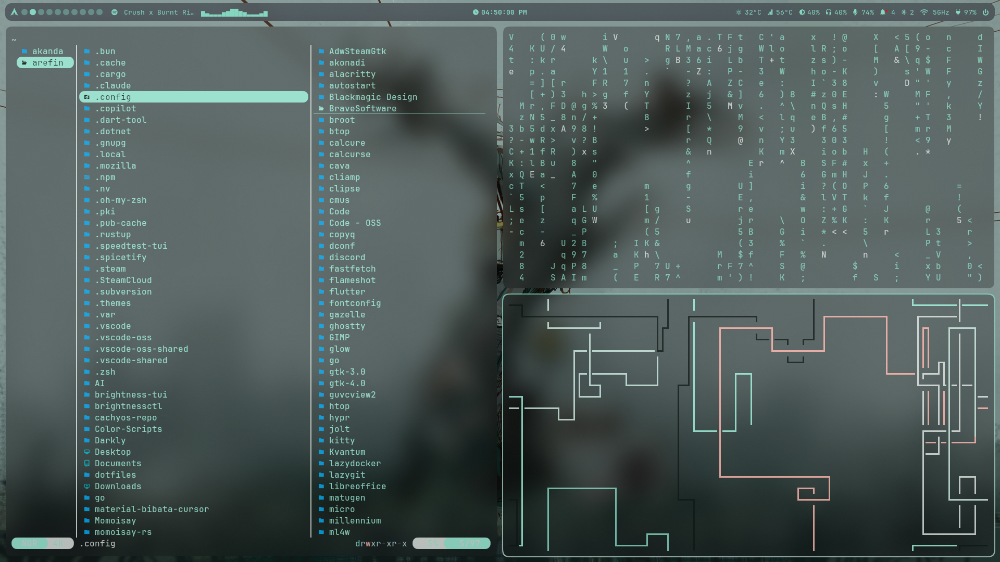
  

  

    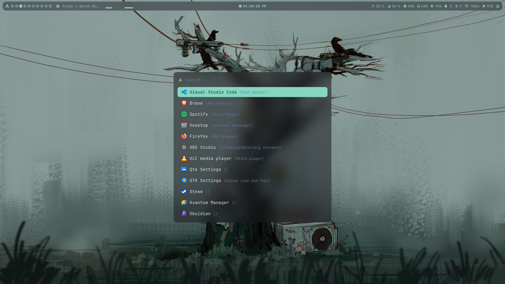
  

  

    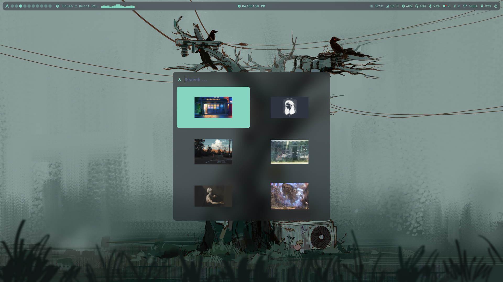
  

  

    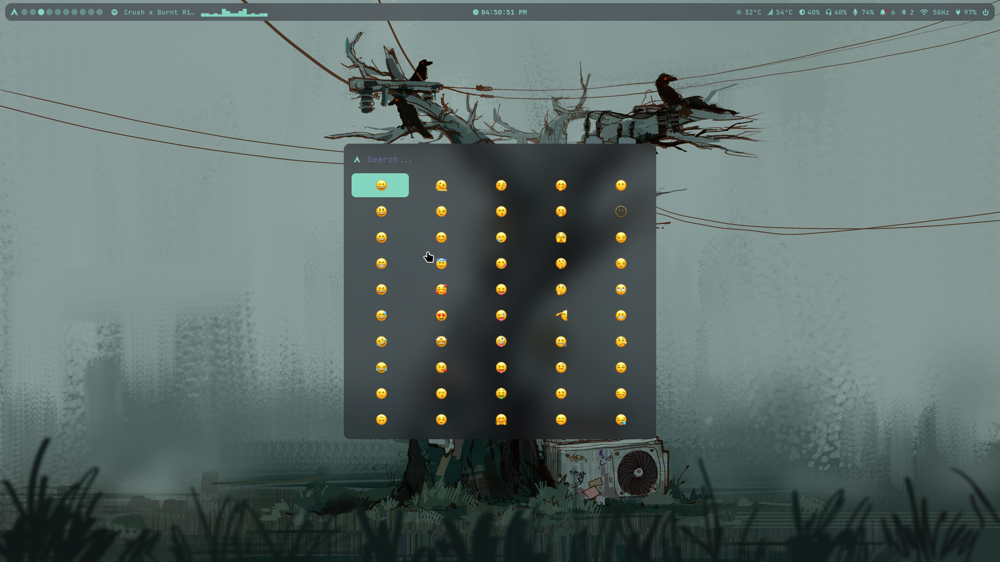
  

  

    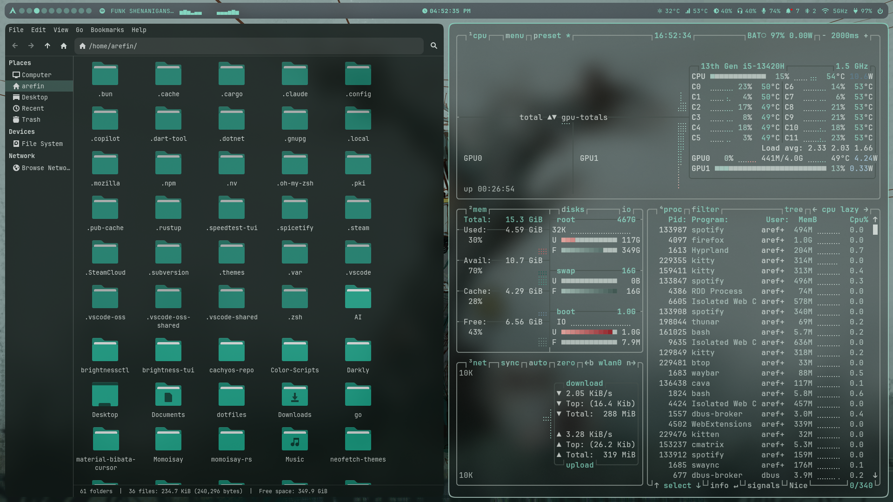
  

  

    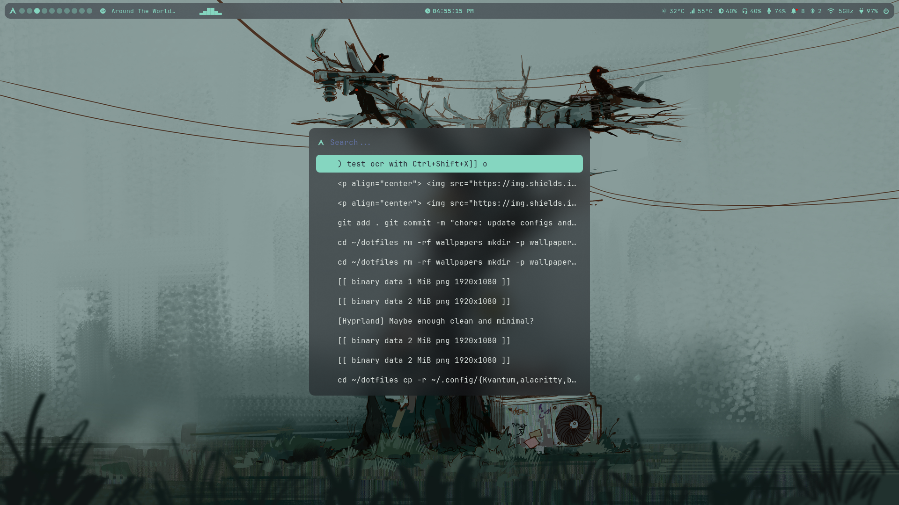
  

  

    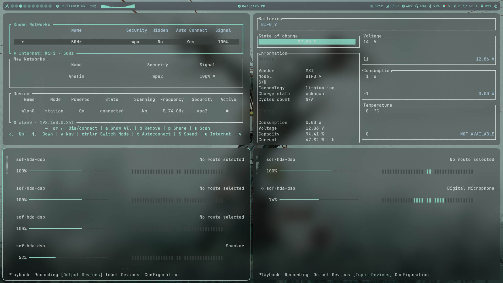
  

  

    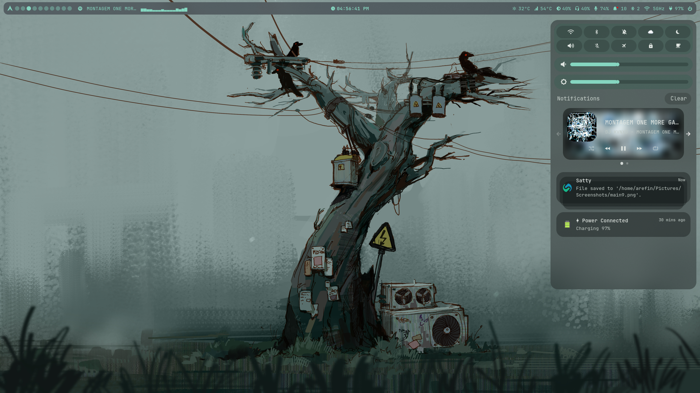
  

  

    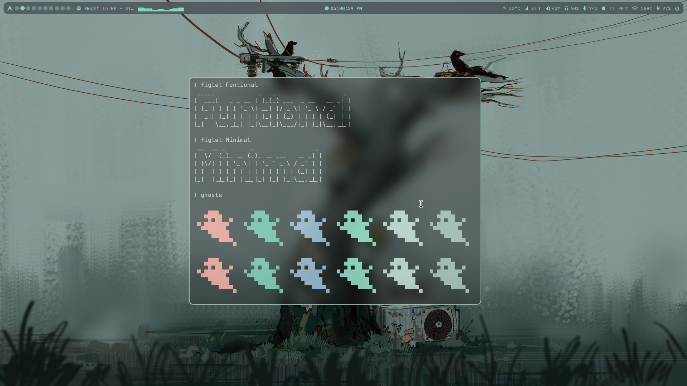
  

  

    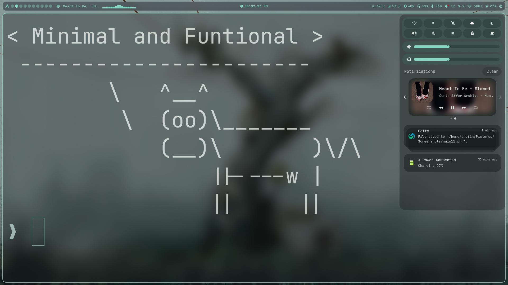
  

  

    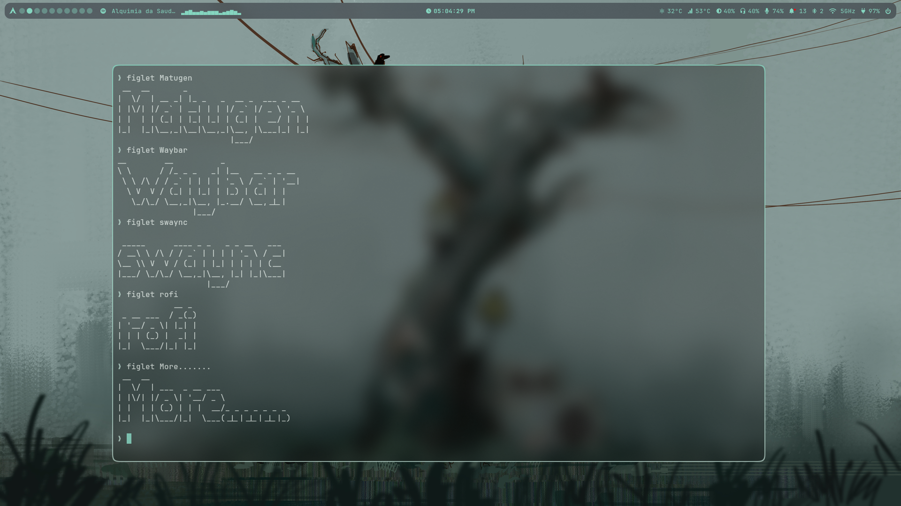
  

  

    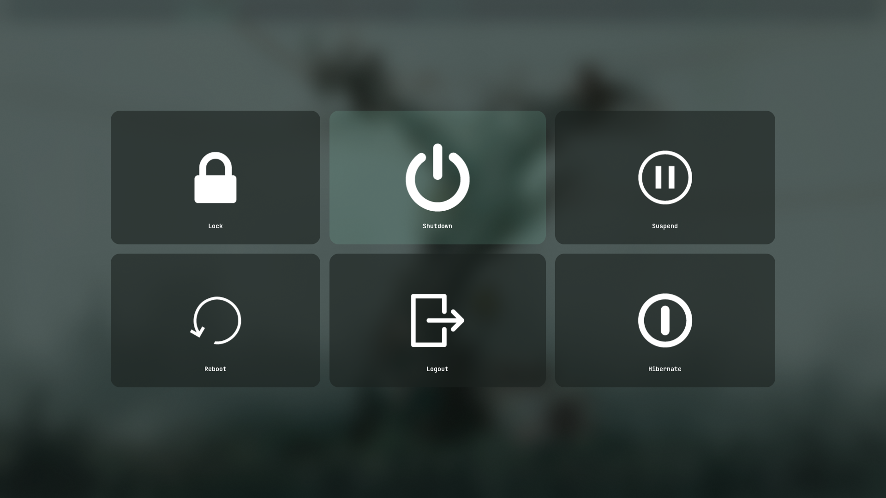
  

  

    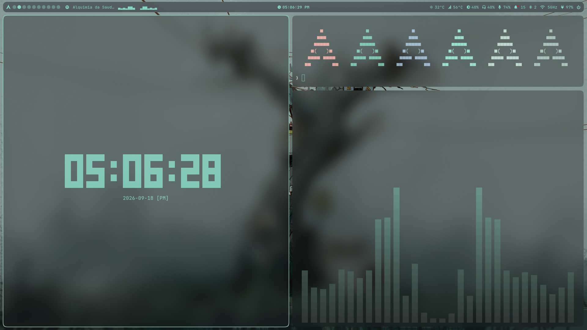
  

